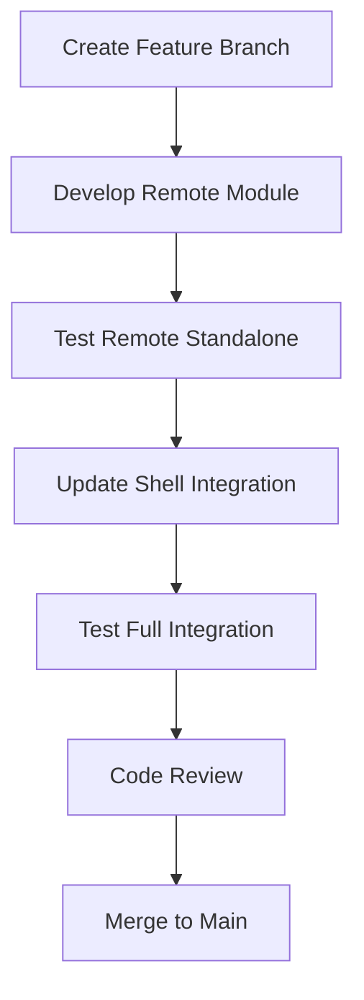

# Development Guide

## 🛠️ Development Environment Setup

### Quick Start

```bash
# Install all dependencies
npm run install:all

# Start both applications
npm start
# or
./start.sh
```

## 📝 Development Workflow

### 1. Feature Development Process



### 2. Working with Remote Modules

**Creating a New Remote Module:**

1. Navigate to the remote application:

   ```bash
   cd remote/src/app
   ```

2. Create your module structure:

   ```bash
   ng generate module feature-name
   ng generate component feature-name/feature-component
   ```

3. Export the module in `federation.config.js`:

   ```javascript
   exposes: {
     './remoteModule': './src/app/remote-main/remote-main.module.ts',
     './newFeature': './src/app/feature-name/feature-name.module.ts'
   }
   ```

4. Test standalone:
   ```bash
   cd remote
   npm start
   ```

### 3. Shell Application Integration

**Loading Remote Modules:**

1. Update the shell's routing or lazy loading configuration
2. Import the remote module using Native Federation syntax
3. Test the integration

### 4. Shared Dependencies Management

**Adding New Shared Dependencies:**

1. Install the dependency in both applications:

   ```bash
   # In remote
   cd remote && npm install <package-name>

   # In shell
   cd shell && npm install <package-name>
   ```

2. Update `federation.config.js` in both apps to share the dependency:
   ```javascript
   shared: {
     ...shareAll({ singleton: true, strictVersion: true }),
     '<package-name>': { singleton: true, strictVersion: true }
   }
   ```

## 🧪 Testing Strategy

### Unit Testing

```bash
# Test remote application
npm run test:remote

# Test shell application
npm run test:shell

# Test both
npm run test:all
```

### Integration Testing

1. Start both applications
2. Navigate through all federated routes
3. Verify module loading and communication
4. Test error scenarios

### E2E Testing

```bash
# Add E2E tests for the complete user journey
cd shell
ng e2e
```

## 🔧 Build and Deployment

### Development Build

```bash
npm run build:all
```

### Production Build

```bash
# Build remote first
cd remote
npm run build --prod

# Build shell
cd shell
npm run build --prod
```

### Deployment Strategy

1. Deploy remote application first
2. Update federation manifest URLs
3. Deploy shell application
4. Verify all remote modules load correctly

## 📊 Performance Monitoring

### Bundle Analysis

```bash
# Analyze remote bundle
cd remote
npm run build -- --stats-json
npx webpack-bundle-analyzer dist/remote/stats.json

# Analyze shell bundle
cd shell
npm run build -- --stats-json
npx webpack-bundle-analyzer dist/shell/stats.json
```

### Performance Checks

- Monitor bundle sizes
- Check for duplicate dependencies
- Verify lazy loading performance
- Test network conditions

## 🐛 Debugging

### Common Debug Commands

```bash
# Clear all caches
npm run clean

# Reinstall dependencies
npm run clean && npm run install:all

# Check federation health
# Navigate to http://localhost:4201/remoteEntry.js
# Should show the remote entry point
```

### Debug Mode

1. Start applications in debug mode:

   ```bash
   cd remote && ng serve --source-map
   cd shell && ng serve --source-map
   ```

2. Use browser dev tools to inspect:
   - Network tab for module loading
   - Console for federation errors
   - Sources for debugging federated code

## 📋 Code Standards

### Naming Conventions

- **Remote Modules**: Use descriptive names (`./userManagement`, `./productCatalog`)
- **Components**: Follow Angular naming conventions (`feature-name.component.ts`)
- **Services**: End with `Service` (`user-data.service.ts`)

### File Organization

```
remote/src/app/
├── shared/              # Shared utilities
├── feature-modules/     # Individual features
│   ├── user-management/
│   ├── product-catalog/
│   └── ...
└── core/               # Core services
```

### Git Workflow

```bash
# Feature development
git checkout -b feature/new-remote-module
git add .
git commit -m "feat: add new remote module for user management"
git push origin feature/new-remote-module

# Create pull request for review
```

## 🔐 Security Considerations

### Content Security Policy

- Configure CSP headers for federated modules
- Validate remote entry points
- Use HTTPS in production

### Module Validation

- Verify module signatures
- Implement runtime security checks
- Monitor for unauthorized modules

## 📚 Additional Resources

- [Angular Native Federation Documentation](https://github.com/angular-architects/native-federation)
- [Microfrontend Best Practices](https://martinfowler.com/articles/micro-frontends.html)
- [Angular Architecture Guide](https://angular.io/guide/architecture)
