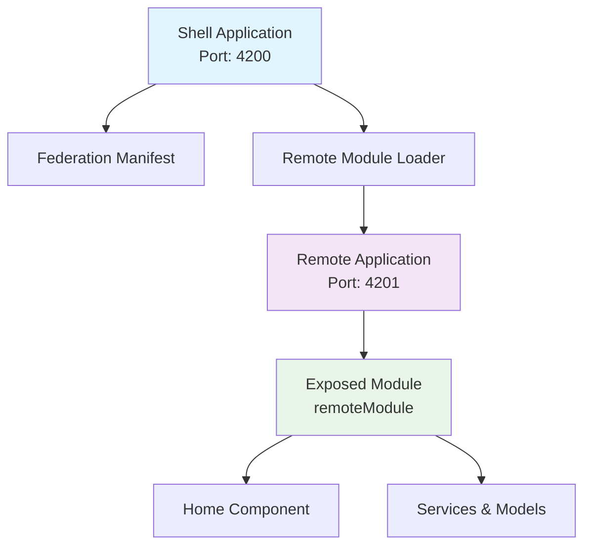
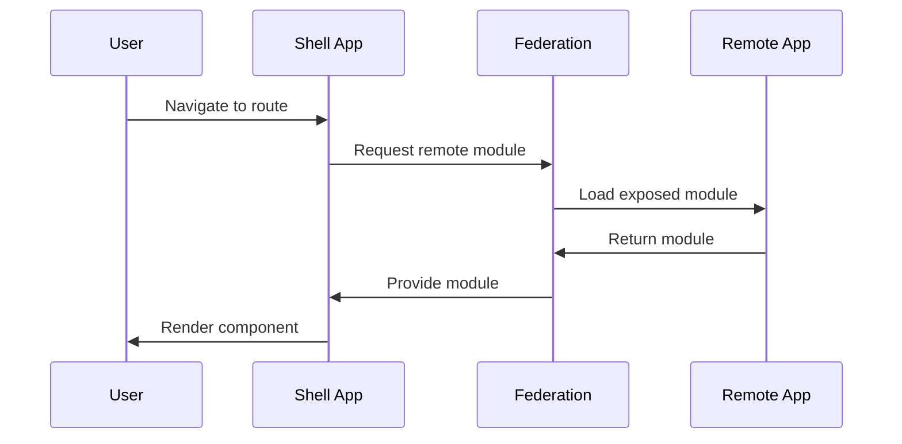
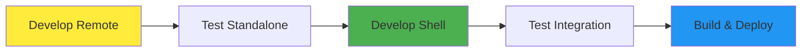

# Native Federation - Advanced Micro-Frontend Architecture

A cutting-edge Angular microfrontend architecture demonstrating advanced Native Federation capabilities with real-time load tracking and modern black & white UI design.

## Architecture Overvi## 📄 License

This project is licensed under the MIT License - see the [LICENSE](LICENSE) file for details.

---

**Happy Coding! 🚀**ject demonstrates a microfrontend architecture with two main applications:

- **Shell Application**: The host application that orchestrates and loads remote modules
- **Remote Application**: A standalone micro-application that exposes modules to be consumed by the shell



## Communication Flow



##  Project Structure

```
Native_Federation/
├──  shell/                          # Host Application (Port: 4200)
│   ├── src/
│   │   ├── app/
│   │   │   ├── app-routing.module.ts   # Routes configuration
│   │   │   ├── app.module.ts           # Main app module
│   │   │   └── home-shell/             # Shell-specific components
│   │   └── assets/
│   │       └── federation.manifest.json # Federation configuration
│   ├── federation.config.js            # Native federation config
│   └── package.json
│
├──  remote/                          # Remote Application (Port: 4201)
│   ├── src/
│   │   ├── app/
│   │   │   ├── app.module.ts
│   │   │   └── remote-main/            # Exposed module
│   │   │       ├── remote-main.module.ts
│   │   │       ├── service.ts
│   │   │       ├── model.ts
│   │   │       └── home/
│   │   │           └── home.component.* # Remote components
│   │   └── bootstrap.ts                # Federation bootstrap
│   ├── federation.config.js            # Exposes remoteModule
│   └── package.json
│
├── README.md
└── .gitignore
```

##  Technology Stack

- **Angular**: v17.0.0
- **Native Federation**: v17.0.7
- **TypeScript**: v5.2.2
- **RxJS**: v7.8.0
- **ES Module Shims**: v1.5.12

##  Getting Started

### Prerequisites

- Node.js (v18 or higher)
- npm (v9 or higher)
- Angular CLI (v17 or higher)

```bash
npm install -g @angular/cli
```

### Installation & Setup

1. **Clone the repository**

   ```bash
   git clone https://github.com/your-username/Native_Federation.git
   cd Native_Federation
   ```

2. **Install dependencies for both applications**

   ```bash
   # Install shell dependencies
   cd shell
   npm install

   # Install remote dependencies
   cd ../remote
   npm install
   ```

### Running the Applications

**Important**: Start the remote application first, then the shell application.

1. **Start the Remote Application** (Terminal 1)

   ```bash
   cd remote
   npm start
   ```

   > Remote app will be available at: http://localhost:4201

2. **Start the Shell Application** (Terminal 2)
   ```bash
   cd shell
   npm start
   ```
   > Shell app will be available at: http://localhost:4200

###  Access the Application

- **Main Application**: http://localhost:4200
- **Remote Application**: http://localhost:4201 (standalone)

##  Development Workflow



### Building for Production

1. **Build Remote Application**

   ```bash
   cd remote
   npm run build
   ```

2. **Build Shell Application**
   ```bash
   cd shell
   npm run build
   ```

##  Configuration Details

### Federation Configuration

**Remote App** (`remote/federation.config.js`):

```javascript
module.exports = withNativeFederation({
  name: "remote",
  exposes: {
    "./remoteModule": "./src/app/remote-main/remote-main.module.ts",
  },
  shared: {
    ...shareAll({ singleton: true, strictVersion: true }),
  },
});
```

**Shell App** (`shell/federation.config.js`):

```javascript
module.exports = withNativeFederation({
  shared: {
    ...shareAll({ singleton: true, strictVersion: true }),
  },
});
```

##  Testing

Run tests for each application:

```bash
# Test shell application
cd shell && npm test

# Test remote application
cd remote && npm test
```

##  Available Scripts

| Command         | Description              |
| --------------- | ------------------------ |
| `npm start`     | Start development server |
| `npm run build` | Build for production     |
| `npm test`      | Run unit tests           |
| `npm run watch` | Build in watch mode      |

## 🔍 Key Features

- **Module Federation**: Seamless integration between shell and remote apps
- **Lazy Loading**: Remote modules loaded on demand
- **Shared Dependencies**: Optimized bundle sharing
- **Independent Development**: Teams can work independently
- **Runtime Integration**: Modules integrated at runtime
- **Scalable Architecture**: Easy to add new micro-frontends

## Troubleshooting

### Common Issues

1. **Remote module not loading**

   - Ensure remote app is running before shell app
   - Check federation.manifest.json configuration
   - Verify exposed module paths

2. **Port conflicts**

   - Shell app: Port 4200
   - Remote app: Port 4201
   - Change ports in angular.json if needed

3. **CORS issues**
   - Ensure both apps are running on localhost
   - Check browser console for federation errors

## Contributing

Feel free to fork and explore the microfrontend architecture! Contributions are welcome.

##  License

This project is licensed under the MIT License - see the [LICENSE](LICENSE) file for details.

<<<<<<< HEAD
=======
Created by **Sharvesh S**

>>>>>>> 1002e64a56bd889f8e8849ea725bd9f00a3e87f0
---

**Happy Coding!**

Add native federation into the remote application - define project, port (in our case **remote**)

```
ng add @angular-architects/native-federation --project remote --port 4201 --type remote
```

Schematics will create _federation.config.js_ which we need to update like this:

```javascript
const {
  withNativeFederation,
  shareAll,
} = require("@angular-architects/native-federation/config");

module.exports = withNativeFederation({
  /// edit this name - it should be specific for each remote application
  name: "remote",

  /// define key and path to the remote remote module (it should be different of app.module.ts)
  exposes: {
    "./remoteModule": "./src/app/remote-main/remote-main.module.ts",
  },

  shared: {
    ...shareAll({
      singleton: true,
      strictVersion: true,
      requiredVersion: "auto",
    }),
  },

  skip: [
    "rxjs/ajax",
    "rxjs/fetch",
    "rxjs/testing",
    "rxjs/webSocket",
    // Add further packages you don't need at runtime
  ],
});
```

## shell project

Create the shell application

```
ng new shell --standalone false
```

Add native federation into the remote application - define project, port (in our case **shell**)

```
ng add @angular-architects/native-federation --project shell --port 4200 --type dynamic-host
```

In the assets edit federation.manifest.json

```json
{
  "remote": "http://localhost:4201/remoteEntry.json"
}
```

Schematics will create also _federation.config.js_ which we are going to let as is.
Also schematics will change **main.ts** which is now initializing Federation

```typescript
import { initFederation } from "@angular-architects/native-federation";

initFederation("/assets/federation.manifest.json")
  .catch((err) => console.error(err))
  .then((_) => import("./bootstrap"))
  .catch((err) => console.error(err));
```

Last step is to edit routing in router module to define async route to remote application:

```typescript
import { NgModule } from "@angular/core";
import { RouterModule, Routes } from "@angular/router";
import { HomeShellComponent } from "./home-shell/home-shell.component";
import { loadRemoteModule } from "@angular-architects/native-federation";

const routes: Routes = [
  {
    path: "",
    component: HomeShellComponent,
    pathMatch: "full",
  },
  {
    /// this is our remote application route
    path: "remote",
    loadChildren: () =>
      loadRemoteModule("remote", "./remoteModule").then(
        (m) => m.RemoteMainModule
      ),
  },
];

@NgModule({
  imports: [RouterModule.forRoot(routes, { useHash: true })],
  exports: [RouterModule],
})
export class AppRoutingModule {}
```

## Issues

Don't forget to setup remote module (entry point in remote app for shell) exactly as is app.module.ts.
This is because we need to register services (in providers, add HttpClientModule and others to support functionality)
